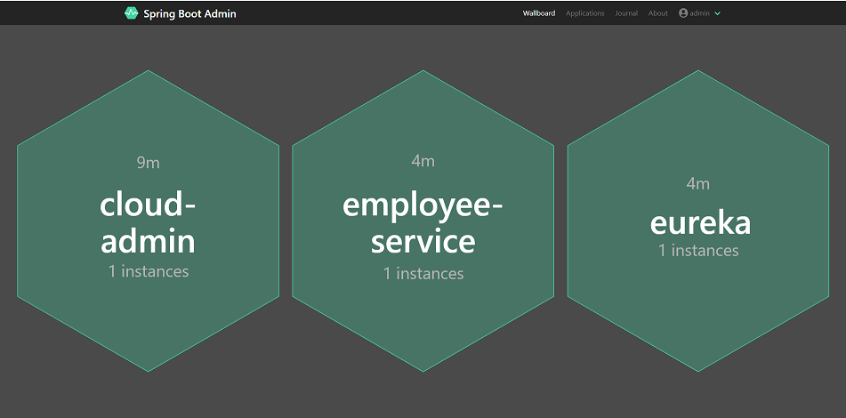
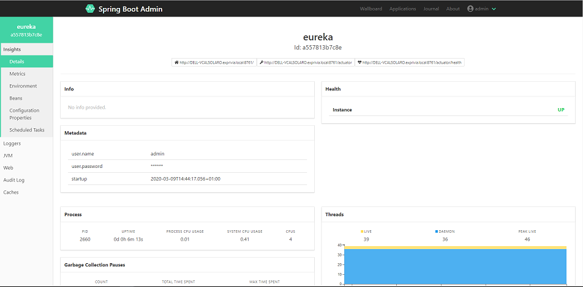

# Spring Boot Admin

> **Sample application using Spring Boot Admin**

## Table of Contents

   * [Spring Boot Admin](#spring-boot-admin)
      * [Architecture](#architecture)
      * [Prerequisites](#prerequisites)
      * [Screenshot](#screenshot)
         * [Wallboard](#wallboard)
         * [Eureka Metrics](#eureka-metrics)
      

## Architecture

Microservice architectural style is an approach to developing a single application as a suite of small services.
In this example the technology stack used is provided by Spring Cloud, in particular:

* **_Spring Boot_** - 2.0.0.RELEASE
* **_Spring Boot Admin/Client Integration_** - Centralized external configuration management

## Prerequisites
* **_JDK 8_** - Install JDK 1.8 version
* **_Maven_** - Download latest version

## Screenshot

### Wallboard

### Eureka Metrics

